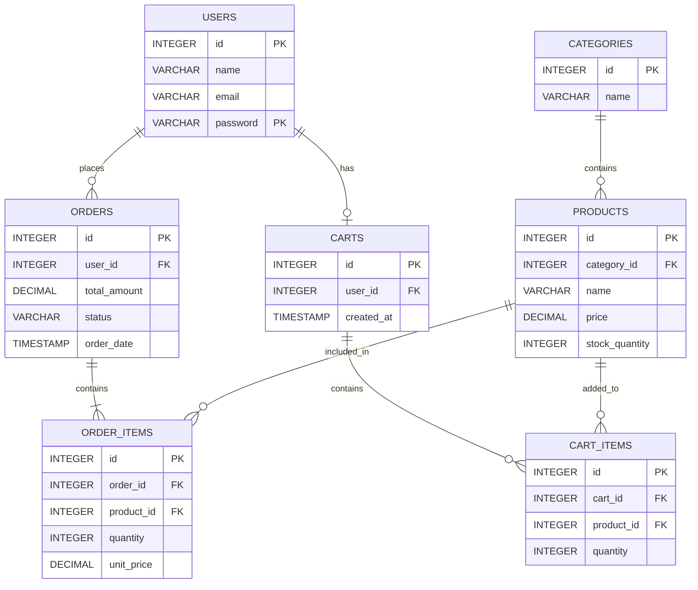

# Sprint 1: Architecture & Scope Definition

## 1. Target Audience & Market Focus

### Primary Persona

Our main users are students and young people who want to buy clothes online.

### Core Problem

People may not have enough time to visit shops. This website will make it easy to see clothes, check prices, add products to a cart, and place an order online.

### Domain Scope

This project is an **Online Fashion and Clothing Store**. It will sell products such as T-shirts, shirts, jeans, trousers, shoes, and jackets.

---

## 2. MVP Feature Scope

| Category | Feature | Description | Priority |
|---|---|---|---|
| Account | Register & Login | Users can create an account and log in. | High (MVP) |
| Products | View Products | Users can see available clothes and their prices. | High (MVP) |
| Search | Search Products | Users can search for a product by name or category. | High (MVP) |
| Cart | Shopping Cart | Users can add, remove, and change product quantity. | High (MVP) |
| Orders | Place Order | Users can check their cart and place an order. | High (MVP) |
| Admin | Manage Products | Admin can add, edit, and delete products. | Medium |

---

## 3. Tech Stack Selection & Justification

### Frontend: HTML, CSS and JavaScript

I will use **HTML, CSS, and JavaScript** for the frontend. HTML will be used to create the website structure, CSS for the design, and JavaScript for basic interactions.

### Backend: PHP

I will use **PHP** for the backend. PHP is commonly used for web development and can handle user login, products, carts, and orders.

### Database: MySQL

I will use **MySQL** as the database. It is suitable for storing users, products, categories, orders, and cart information.

### Caching: Not Required

Caching is not required for the first version of the project. It can be added later if the website needs better performance.

---

## 4. Entity-Relationship Diagram (ERD)

The ERD shows the main tables and how they are connected.

### Relationships

- One **User** can place many **Orders**.
- One **User** can have one active **Cart**.
- One **Category** can have many **Products**.
- One **Order** can have many **Order Items**.
- One **Product** can be in many **Order Items**.
- One **Cart** can have many **Cart Items**.
- One **Product** can be added to many **Carts**.

The **Order_Items** table connects Orders and Products.

The **Cart_Items** table connects Carts and Products.

All main tables have a **Primary Key (PK)**, and related tables use **Foreign Keys (FK)**.
